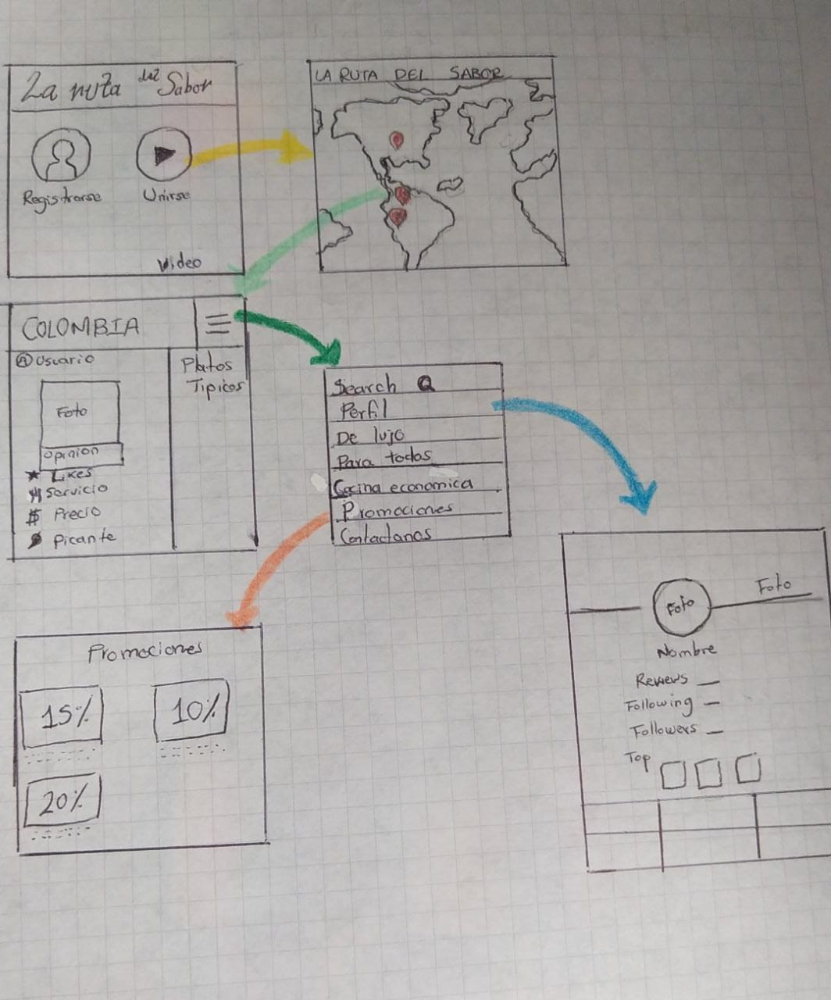
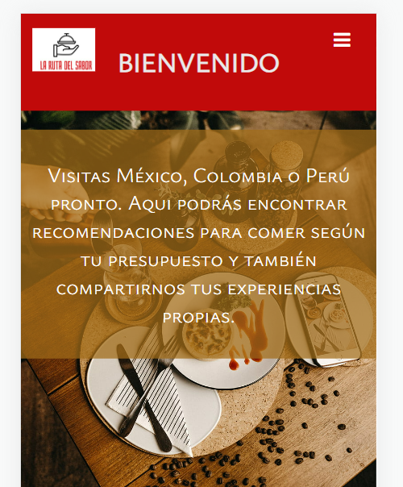
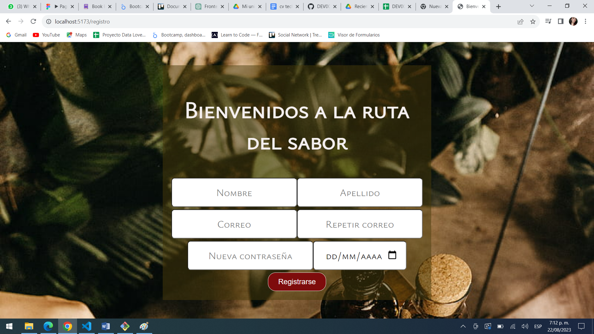

# La ruta del sabor

## Índice

Definición del producto.
* [1. Definición del producto](#1-Definición-del-producto)
* [2. Proceso de diseño.](#2-Proceso-de-diseño.)
* [3. ¿Como el producto resulve los problemas que tiene el usuario?](#3-Como-el-producto-resulve-los-problemas-que-tiene-el-usuario.)
* [4. Historias de usuario](#4-Historias-de-usuario)
* [5. Prototipo de baja fidelidad](#5-Prototipo-de-baja-fidelidad)
* [6. Test usabilidad](#6-Test-usabilidad)
* [7. Prototipo de alta fidelidad](#7-Prototipo-de-alta-fidelidad)
* [8. Pruebas unitarias](#8-Pruebas-unitarias)
* [9. Producto final](#9-Producto-final)

## 1. Definición del producto

La ruta del sabor es una innovadora aplicación de críticas y recomendaciones gastronómicas que permite a los usuarios explorar y compartir experiencias en una variedad de restaurantes en diferentes países. Con una interfaz intuitiva y amigable, los usuarios pueden subir reseñas detalladas, otorgar puntuaciones y expresar sus opiniones sobre los restaurantes que visitan.

La característica distintiva de La ruta del sabor, radica en su capacidad para llevar la experiencia culinaria a un nivel global. La aplicación cuenta con un mapa interactivo que permite a los usuarios navegar por diferentes países, como México, Perú y Colombia, y explorar reseñas y recomendaciones de restaurantes en cada uno de estos lugares. Esta función es perfecta para aquellos que buscan aventuras gastronómicas en el extranjero o simplemente desean conocer las opciones culinarias en diferentes culturas.

La aplicación también ofrece una clasificación inteligente de restaurantes en tres categorías principales: "Lujo", "Para Todos" y "Cocina Económica". Esto garantiza que los usuarios puedan filtrar sus búsquedas según sus preferencias y presupuestos, asegurando que encuentren las opciones que mejor se adapten a sus necesidades.

## 2. Proceso de diseño

El proceso de diseño de la aplicación "La Ruta del Sabor" fue un viaje emocionante que comenzó con una idea que unió la pasión por la comida y la diversidad cultural de tres países. Aquí está el resumen de cómo se desarrolló la aplicación desde la concepción hasta la realización:

1. Generación de Ideas
El equipo se reunió y discutió ideas que podrían atraer a un público amplio y conectar los elementos culturales de México, Perú y Colombia. La comida emergió como un tema valioso y emocionante para explorar, ya que era un punto en común que resonaba con muchas personas.

2. Conceptualización y Prototipo de Baja Fidelidad
El equipo comenzó a trabajar en la idea de "La Ruta del Sabor", una aplicación para explorar y revisar restaurantes en los tres países. Se creó un prototipo de baja fidelidad que capturó las ideas principales de la interfaz y la funcionalidad. Este prototipo permitió al equipo visualizar y discutir cómo se vería y se sentiría la aplicación.

3. Testeo de Usabilidad
El prototipo de baja fidelidad se sometió a pruebas de usabilidad con personas externas al equipo. Estas pruebas ayudaron a identificar puntos débiles en la usabilidad y a recoger comentarios valiosos de los usuarios sobre la experiencia general. Se realizaron ajustes basados en estos comentarios para mejorar la aplicación.

4. Prototipo de Alta Fidelidad en Figma
Utilizando las lecciones aprendidas del testeo de usabilidad, el equipo creó un prototipo de alta fidelidad en Figma. Esto incluyó detalles visuales, diseño de interfaz y flujo de usuario más elaborados. El prototipo se compartió con el equipo y otros para obtener comentarios adicionales.

5. Pruebas de Usabilidad en el Prototipo de Alta Fidelidad
El prototipo de alta fidelidad se sometió a pruebas de usabilidad similares a las realizadas con el prototipo de baja fidelidad. Los comentarios recopilados permitieron al equipo refinar aún más la interfaz y la experiencia del usuario.

6. Investigación sobre Firebase y Firestore
El equipo investigó y se capacitó en Firebase y Firestore, que serían las herramientas de enrutamiento y almacenamiento de datos para la aplicación. Esto aseguró que el equipo estuviera preparado para implementar la funcionalidad principal de la aplicación.

7. Iteración y Mejoras
Basándose en el feedback de los usuarios y en la retroalimentación de los compañeros de equipo y coaches, se realizaron ajustes y mejoras continuas en la aplicación. Esto incluyó cambios en el diseño, la usabilidad y la funcionalidad en función de las necesidades y expectativas de los usuarios.

8. Lanzamiento y Conclusión
A pesar de los desafíos, como la pérdida de un miembro del equipo, el grupo perseveró y logró finalizar la aplicación "La Ruta del Sabor". El resultado fue una aplicación que permitía a los usuarios explorar, revisar y descubrir restaurantes en México, Perú y Colombia, fusionando la pasión por la comida y la cultura de estos países en una experiencia única y valiosa.

El proceso de diseño de "La Ruta del Sabor" demostró la importancia de la iteración constante, la escucha activa a los usuarios y la adaptación a medida que surgían desafíos. El equipo logró superar obstáculos y construir con orgullo una aplicación que celebraba la riqueza culinaria y cultural de los tres países.

## 3. ¿Como nuestra app soluciona los problemas del usuario?

Problemas del Usuario:
1. Falta de Conexión con la Oferta Gastronómica: Los usuarios pueden tener dificultades para descubrir nuevos restaurantes y opciones culinarias en sus países o en destinos extranjeros.

2. Falta de Información Confiable: Los usuarios pueden enfrentar dificultades para encontrar reseñas y recomendaciones confiables de restaurantes que se ajusten a sus preferencias y presupuesto.

3. Falta de Diversidad Culinaria: Pueden sentir que su oferta culinaria es limitada y quieran explorar platos y sabores de otras culturas.

Soluciones Proporcionadas por "La Ruta del Sabor":

1. Exploración Global y Local: La aplicación ofrece a los usuarios la capacidad de explorar restaurantes tanto en sus países de origen como en otros países. El mapa interactivo les permite navegar por México, Perú y Colombia, brindando una experiencia global de las diversas ofertas culinarias.

2. Reseñas y Recomendaciones Personalizadas: Los usuarios pueden acceder a reseñas y recomendaciones detalladas de otros usuarios que han visitado los restaurantes. Estas opiniones auténticas ayudan a los usuarios a tomar decisiones informadas al elegir dónde comer. Además, las categorías de lujo, para todos y cocina económica permiten a los usuarios filtrar las opciones según sus preferencias.

3. Exploración Cultural y Culminación: "La Ruta del Sabor" promueve la diversidad culinaria al permitir a los usuarios explorar platos y sabores auténticos de México, Perú y Colombia. Los usuarios pueden experimentar y aprender sobre diferentes tradiciones culinarias, lo que fomenta la conexión cultural y la apreciación de la comida de cada país.

## 4. Historia de usuario
Las siguientes historias de usuario capturan las diversas necesidades y deseos de nuestros usuarios al interactuar con la aplicación "La Ruta del Sabor". Estas historias reflejan cómo la aplicación aborda problemas comunes relacionados con la exploración culinaria, la búsqueda de recomendaciones y la conexión con la riqueza gastronómica de México, Perú y Colombia. Cada historia destaca una función específica de la aplicación que permite a los usuarios disfrutar de una experiencia gastronómica enriquecedora y satisfactoria. A través de estas historias, ilustramos cómo "La Ruta del Sabor" se convierte en el compañero ideal para los amantes de la comida que desean explorar nuevos sabores y tradiciones culinarias.

### HU1: INGRESO Y REGISTRO

Como catadora de restaurante deseo una aplicación en la que pueda tener una comunidad, en donde pueda registrarme, ingresar y compartir mis experiencias en el mundo culinario. Espero encontrar un espacio donde se visualicen las opciones de ingreso y registro.

Criterios de aceptación: 
1. Para el ingreso de la aplicación deberá ser necesario la autenticación con una cuenta de google o con correo y  contraseña.
2. Este ingreso solo permitirá cuentas válidas.
3. Es necesario que el campo de input de contraseña sea secreto. 
4. Al enviar el formulario de registro se validará antes de ingresar.
5. Si hay errores debe mostrar mensajes descriptivos para poder corregirlos.

Definición de terminado 

[✔️] En la pantalla inicial se encuentra la descripción de la aplicación.

[✔️] Hay dos botones que direccionan a  registrar o ingresar.

[✔️] El espacio de registro cuenta con una vista donde el usuario agrega sus datos personales como (nombre, apellido, correo, contraseña y fecha de nacimiento).

[✔️] El espacio de ingreso tiene una vista con las opciones de correo y contraseña o vinculación con una cuenta google.

[✔️] Para agregar la contraseña salen los números o las letras enmascaradas para que solo el usuario la conozca.

[✔️] Se autentica la información proporcionada por el usuario en el formulario de ingreso.

[✔️] Cuenta con alertas en caso de que el usuario deba realizar modificaciones para ingresar. 

### HU2: PUBLICACIONES 

Yo, como ama de casa deseo una aplicación en la que pueda compartir y revisar recomendaciones  de otros usuarios, que como yo probamos diferentes restaurantes en esta aplicación debe permitirme realizar publicaciones y revisar las publicaciones de los demás.

Criterios de aceptación: 
1. En la app debe existir un espacio en donde se creen los post de los usuarios.
2. La app muestra información relevante que el usuario debe completar para compartir su post.
3. Deben ser visibles las publicaciones de los usuarios en un muro de inicio. 

Definición de terminado:

[✔️] Existencia de un input donde el usuario pueda compartir sus experiencias.

[✔️] La información relevante que debe completar el usuario para poder compartir su post es: País, nombre del restaurante, calificar la experiencia en servicio (por medio de tenedores, 1 siendo el más malo y 5 el mejor) el rango económico que se llevará  a cabo con los signos pesos (siendo 1 el más barato y 5 el más caro) y el nivel de picante que se tomar con un ají/chile en donde 1 será menos picantes y 5 siendo el más picante.

[✔️] En el muro de inicio deben ser visibles todas las publicaciones realizadas por otros usuarios sobre el país y restaurante mencionado.

### HU3:VISTAS SECCION: PAÍSES

Yo, como viajera, deseo una app en donde pueda revisar las recomendaciones de restaurantes y comidas típicas que hay en cada país disponible en la app. Dicha app debe tener una vista para cada país en donde pueda visualizar un espacio exclusivo de las comidas típicas en dicho país, y un muro donde vea las recomendaciones exclusivas de dicho país.

Criterios de aceptación 
1. En la página de inicio es posible dirigirse a un país en específico y encontrar las recomendaciones y comida típica de cada país.
2. Cada publicación será visible en el muro del país mencionado en el post del usuario.
3. El usuario puede acceder al espacio de platos típicos para detallar más la información.
4. El usuario cuenta con un menú desplegable en el que le dará la posibilidad al usuario de navegar sitios como: búsqueda de restaurantes específico, su perfil, los restaurantes que por su precio son considerados de lujo, para todos, o cocinas económicas, las promociones existentes en los diferentes establecimientos y un botón para volver al muro actual.
5. En el muro el usuario encontrará un botón que lo llevará al espacio del mapa en donde podrá elegir cualquier otro país que desee o cerrar sesión de la app.

Definición de terminado:

[✔️] Se visualizan los países claramente para que puedan ser seleccionados por los usuarios. (mapa y cerrar sesión)

[✔️] En la sesión de platos típicos, los usuarios visualizarán 3 platos típicos según el país al que hayan ingresado y podrá entrar a ese espacio  y encontrar más recomendaciones de platos típicos que otros usuarios o el mismo pueda poner allí.

[✔️] El usuario puede acceder a un menú desplegable, para poder dirigirse a distintas recomendaciones según sea su interés.

[✔️] El usuario encontrará un botón que lo llevará al espacio del mapamundi en donde podrá elegir otro país para acceder o si desea podrá cerrar sesión de la aplicación.
 
### HU4:EDITAR Y BORRAR PUBLICACIONES

Como joven que usa redes sociales continuamente deseo una aplicación en la que las publicaciones que ya no me representen puedan ser editadas o  eliminadas de mi perfil, esta aplicación debe tener un botón claro que me indique donde y cuando puedo editar o borrar dicha publicación de mi perfil.

Criterio de aceptación:

1. Hay un botón para editar la publicación. 
2. Cuando se realice los cambios debe haber un botón para guardar los cambios
3. Hay un botón para borrar una publicación 
4. Hay un prompt que le solicite confirmación para borrar dicha publicación.
 
Definición de terminado:

[✔️] El usuario tendrá un botón de editar donde al oprimirlo lo direccione a un input donde se pueda realizar los cambios.

[✔️] Al guardar cambios el texto vuelve a su formato inicial pero solamente con los cambios realizados, dichos cambios son guardados y vistos hasta en el muro del país seleccionado y en perfil del usuario.

[✔️] El usuario tiene un botón de borrado en las publicaciones que acaba de hacer o las que realiza con anterioridad, dicha eliminación debe mantenerse después de la confirmación del usuario y no podrá verse en ninguna sección de la app.

### HU5:ME GUSTAS (LIKES ⭐) 

Como emprendedor de pequeña empresa, deseo una app en donde pueda revisar los likes de mis propias recomendaciones o de otros usuarios para ver el alcance de reconocimiento que está teniendo mi negocio.

Criterios de aceptación:
1. En la publicación encontramos el símbolo de la estrella que se usará para dar like a las publicaciones.
2. Aparecerá el número de likes de cada publicación.

Definición de terminado:  

[✔️] Se podrá dar like a cada publicación (aparecerá el símbolo usado para ello).

[✔️] Se podrá quitar este like y el contador responderá a este cambio.

[✔️] Se mostrará el total de likes de cada publicación.

#### 5. Prototipo de baja fidelidad 
El proceso de diseño de "La Ruta del Sabor" comenzó con la etapa de baja fidelidad, donde exploramos y plasmamos las ideas iniciales de la aplicación en prototipos simples pero efectivos. Esta etapa fue esencial para visualizar la estructura, el flujo de usuario y las interacciones básicas que conformarían la experiencia general de la aplicación. A través del diseño de baja fidelidad, pudimos experimentar con diferentes enfoques y evaluar rápidamente cómo se comportaría la aplicación en sus primeras etapas. 

### 6. Test usabilidad 
En nuestro compromiso por ofrecer una experiencia excepcional a nuestros usuarios, el equipo de desarrollo de "La Ruta del Sabor" ha realizado un exhaustivo test de usabilidad. Este proceso ha sido esencial para evaluar la facilidad de uso, la navegación y la satisfacción general de los usuarios al interactuar con nuestra aplicación. A través del test de usabilidad, hemos tenido la oportunidad de obtener valiosos comentarios y comprender cómo los usuarios experimentan cada aspecto de "La Ruta del Sabor". En esta presentación, compartiremos los resultados clave del test de usabilidad y destacaremos las áreas en las que hemos realizado mejoras significativas para garantizar una experiencia fluida y placentera para nuestros usuarios.

### 7. Prototipo de alta fidelidad 

El prototipo de alta fidelidad de la aplicación "La Ruta del Sabor" marca un emocionante paso adelante en el proceso de diseño. En esta etapa, hemos llevado las ideas y conceptos iniciales a un nivel visualmente impactante y funcionalmente realista. Este prototipo detallado refleja la interacción precisa de los elementos de la interfaz y la experiencia del usuario en su totalidad. A través del diseño de alta fidelidad, hemos dado vida a las funciones clave de la aplicación y hemos establecido una representación visual cercana a la versión final. A continuación, compartimos el proceso y la importancia de nuestro prototipo de alta fidelidad.

link figma escritorio: https://www.figma.com/proto/ZRXxlx2k3wQpiv43gza5gr/Ruta-del-Sabor?type=design&node-id=6-269&t=JsoZtF0fhw0xjlYs-0&scaling=scale-down&page-id=0%3A1&starting-point-node-id=6%3A269

link figma tablet:https://www.figma.com/proto/br2sso8CZhGw2jTN7HM6fV/Untitled?type=design&node-id=1-2&t=2BY4ZEl6eKPyGaXM-0&scaling=scale-down&page-id=0%3A1&starting-point-node-id=1%3A2

link figma mobile: https://www.figma.com/proto/wFmTXQl1X01635IinNGBES/Untitled?type=design&node-id=1-2&t=hAMMqmvtUht9ctr7-0&scaling=scale-down&page-id=0%3A1&starting-point-node-id=1%3A2

### 8. Pruebas unitarias

En la búsqueda de crear una aplicación robusta y confiable, el equipo de desarrollo de "La Ruta del Sabor" ha implementado un conjunto de test unitarios utilizando Jest y mocks. Estos tests desempeñan un papel esencial al asegurarse de que cada función y componente de la aplicación funcione según lo previsto. A través de los test unitarios, hemos podido identificar y solucionar problemas en el código, garantizando una experiencia de usuario fluida y sin fallos. A continuación, exploramos la importancia de los test unitarios y cómo han contribuido al éxito de nuestra aplicación.

### 9. Producto final 

En la vibrante travesía de la aplicación "La Ruta del Sabor", las imágenes cobran vida para llevar a nuestros usuarios en un recorrido visual por las emocionantes características y la experiencia única que ofrece nuestra aplicación. Estas imágenes capturan la esencia de la aplicación y reflejan el resultado de un esfuerzo conjunto para crear una interfaz visualmente atractiva y funcional. A través de esta presentación de imágenes, les invitamos a sumergirse en la exquisita variedad culinaria y la experiencia gastronómica que "La Ruta del Sabor" tiene para ofrecer. Acompáñennos mientras exploramos visualmente las distintas facetas de nuestra aplicación.

